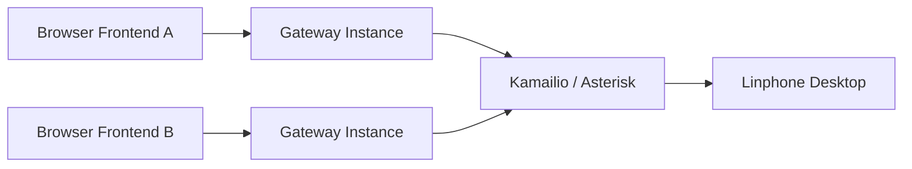

# WebRTC Gateway Dual-Flow Design

## 1) Supported Call Flows

### Flow A: Browser -> Linphone
`browser -> gateway -> kamailio/asterisk -> linphone desktop`

### Flow B: Browser -> Browser (via SIP core)
`browser frontend -> gateway -> kamailio/asterisk -> gateway -> browser frontend`

---

## 2) High-Level Architecture

- Gateway is the single WebRTC<->SIP bridge in both flows.
- Kamailio/Asterisk is the signaling and routing core.
- `sip_trunks` credentials and lease ownership drive incoming/outgoing routing.

---

## 3) Detailed Runtime Flows

### 3.1 Outbound Browser -> Linphone
1. Browser A opens WebSocket to gateway and sends `offer`.
2. Gateway replies `answer` with `sessionId`.
3. Browser A sends `call` (destination = Linphone extension/URI + trunk context).
4. Gateway sends SIP INVITE to Kamailio/Asterisk.
5. PBX routes to Linphone.
6. Linphone answers with 200 OK, media flows through gateway.
7. Either side hangs up -> BYE -> session ends.

### 3.2 Outbound Browser -> Browser (via SIP core)
1. Browser A and Browser B connect WebSocket and run `trunk_resolve`.
2. Browser A sends `offer`, then `call` to Browser B destination.
3. Gateway A sends SIP INVITE to Kamailio/Asterisk.
4. PBX routes INVITE to Browser B trunk identity (registered via gateway).
5. Receiving gateway creates incoming session and pushes `incoming` to trunk-resolved Browser B clients.
6. Browser B auto-prepares local media session if needed, then sends `accept`.
7. Gateway sends 200 OK and bridges media B <-> SIP core <-> A.
8. Session terminates via hangup/BYE.

---

## 4) WebSocket Signaling

### Client -> Gateway
- `offer`
- `trunk_resolve`
- `call`
- `accept`
- `reject`
- `hangup`
- `resume`

### Gateway -> Client
- `answer`
- `incoming`
- `state`
- `trunk_resolved`
- `trunk_redirect`
- `resume_redirect`
- `resumed`
- `resume_failed`
- `error`

---

## 5) Operational Rules

1. Frontend must trigger `trunk_resolve` after every WebSocket connect/reconnect.
2. Incoming accept must have an established local WebRTC session.
3. Incoming notifications are fanout-filtered by resolved trunk.
4. Trunk routing identity must be unambiguous for inbound INVITE matching (prefer per-user unique target such as username+domain+port).
5. Codec policy stays fixed: Opus audio passthrough + H.264 video.
6. Watch logs for trunk match rule/candidates, `trunk_resolve`, incoming fanout, accept path, and resume results.
